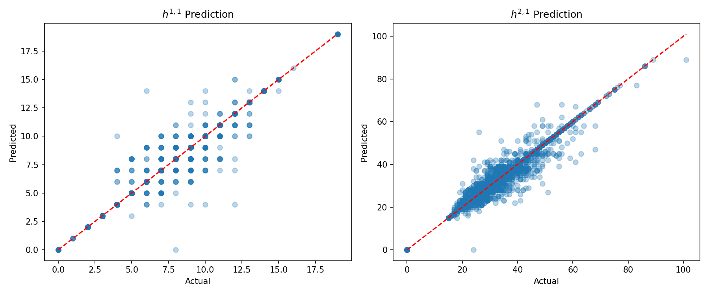

# CICY Topology ML

A PyTorch project for predicting topological quantities (Hodge numbers) from CICY (Complete Intersection Calabi-Yau) dataset representations using a convolutional neural network.

## Contents

- `src/` — training and model code
- `data/` — dataset (raw and processed)
- `models/` — saved model weights
- `notebooks/` — exploratory notebooks
- `plots/` — visualization outputs

## Quickstart

1. Create a Python virtual environment and activate it:

   ```powershell
   python -m venv venv
   .\venv\Scripts\Activate.ps1
   ```

2. Install dependencies:

   ```powershell
   pip install -r requirements.txt
   ```

3. Prepare data

   ```powershell
   # Parse raw data
   python src/preprocessing/parser.py

   # Enhance dataset with scalar geometric features
   python src/preprocessing/enhance.py

   # Verify processed data
   python check.py
   ```

   Expected files:
   - `data/processed/X_cicy3.npy` — raw configuration matrices
   - `data/processed/X_enhanced.npy` — enhanced feature set used by training
   - `data/processed/y_hodge.npy` — target Hodge numbers

4. Run training

   ```powershell
   python src\train_enhanced.py
   ```

## Project structure

- `src/preprocessing/parser.py` — parses raw CICY 3-fold data from text into NumPy arrays
- `src/preprocessing/enhance.py` — adds scalar geometric features to the dataset
- `src/train_enhanced.py` — main training script (loads enhanced data, creates dataloaders, trains model with dual Hodge outputs)
- `src/models/cnn_model.py` — dual-head CNN classifier for predicting h^{1,1} and h^{2,1}
- `src/eval.py` — evaluation script that runs inference and plots predicted vs actual Hodge numbers
- `src/accuracy.py` — computes exact classification accuracy on all samples
- `src/error_analysis.py` — identifies worst misclassified manifolds and visualizes their configuration matrices
- `check.py` — sanity checks for processed data (reports label ranges and cardinalities)

## Data format

- `X_cicy3.npy`: float32 array of CICY configuration matrices (shape: N × 12 × 15)
- `X_enhanced.npy`: float32 array combining flattened matrices with scalar geometric features (shape: N × 181)
  - First 180 features: flattened 12×15 configuration matrix
  - Last feature: ambient factor count (number of non-zero rows)
- `y_hodge.npy`: int64 array of Hodge numbers (shape: N × 2) → [h^{1,1}, h^{2,1}]

## Saving and loading models

- Trained weights are saved by default to `models/cicy_cnn_v1.pt`.
- To load weights in code:

```python
from src.models.cnn_model import CICYClassifier
model = CICYClassifier()
model.load_state_dict(torch.load('models/cicy_cnn_v1.pt', map_location='cpu'))
model.eval()
```

## Results

Below is a visualization of model predictions vs. actual Hodge numbers:



The plots show scatter distributions of predicted vs. actual h^{1,1} and h^{2,1} values, with the red dashed line indicating perfect predictions.

### Model Performance

```
Total manifolds evaluated : 7890
h^{1,1} exact accuracy     : 96.67%
h^{2,1} exact accuracy     : 76.51%
```

The model achieves high accuracy on h^{1,1} prediction (96.67%) and demonstrates substantial learning on h^{2,1} (76.51%), indicating strong predictive capability for topological properties of CICY 3-folds.

## Common issues

- **Module import errors**: ensure you run commands from the project root or use an editable install.
- **Missing data files**: ensure data preparation steps are complete, especially `data/processed/X_enhanced.npy` and `data/processed/y_hodge.npy` before running training.

## Contributing

PRs are welcome. Open issues for bugs or feature requests. Include reproducible steps and small, focused changes.

## Contact

```
Samreet Singh Dhillon,
M.Sc. Physics, Panjab Univerity
samreetsinghdhillon@gmail.com
```
